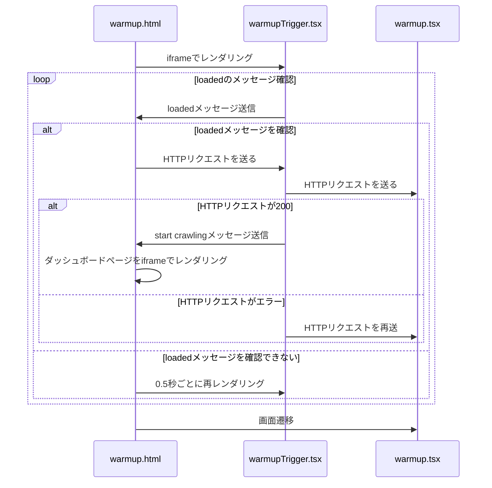

```mermaid
sequenceDiagram
    participant warmup.html
    participant warmupTrigger.tsx
    participant warmup.tsx

    warmup.html->>warmupTrigger.tsx: iframeでレンダリング
    loop loadedのメッセージ確認
        warmupTrigger.tsx->>warmup.html: loadedメッセージ送信
        alt loadedメッセージを確認
            warmup.html->>warmupTrigger.tsx: HTTPリクエストを送る
            warmupTrigger.tsx->>warmup.tsx: HTTPリクエストを送る
            alt HTTPリクエストが200
                warmupTrigger.tsx->>warmup.html: start crawlingメッセージ送信
                warmup.html->>warmup.html: ダッシュボードページをiframeでレンダリング
            else HTTPリクエストがエラー
                warmupTrigger.tsx->>warmup.tsx: HTTPリクエストを再送
            end
        else loadedメッセージを確認できない
            warmup.html->>warmupTrigger.tsx: 0.5秒ごとに再レンダリング
        end
    end
    warmup.html->>warmup.tsx: 画面遷移
```