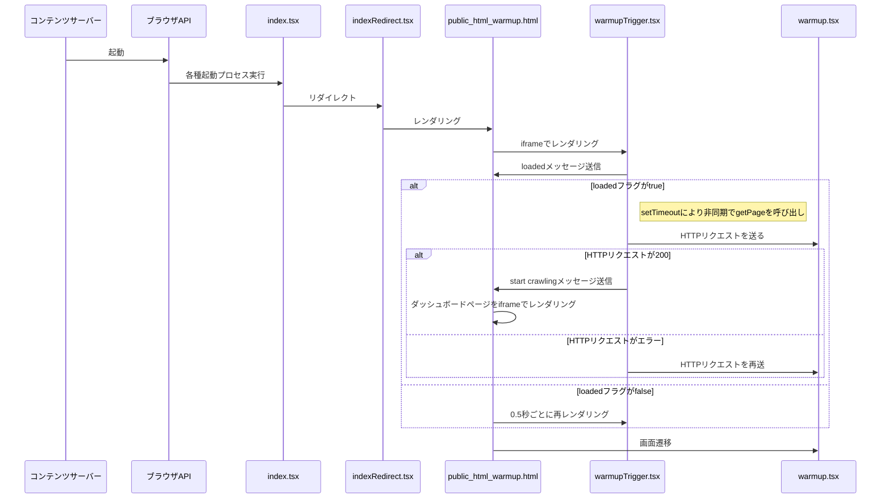

```mermaid
sequenceDiagram
    participant コンテンツサーバー
    participant ブラウザAPI
    participant index.tsx
    participant indexRedirect.tsx
    participant public_html_warmup.html
    participant warmupTrigger.tsx
    participant warmup.tsx

    コンテンツサーバー->>ブラウザAPI: 起動
    ブラウザAPI->>index.tsx: 各種起動プロセス実行
    index.tsx->>indexRedirect.tsx: リダイレクト
    indexRedirect.tsx->>public_html_warmup.html: レンダリング
    public_html_warmup.html->>warmupTrigger.tsx: iframeでレンダリング
    warmupTrigger.tsx->>public_html_warmup.html: loadedメッセージ送信
    alt loadedフラグがtrue
        Note right of warmupTrigger.tsx: setTimeoutにより非同期でgetPageを呼び出し

        warmupTrigger.tsx->>warmup.tsx: HTTPリクエストを送る
        alt HTTPリクエストが200
            warmupTrigger.tsx->>public_html_warmup.html: start crawlingメッセージ送信
            public_html_warmup.html->>public_html_warmup.html: ダッシュボードページをiframeでレンダリング
        else HTTPリクエストがエラー
            warmupTrigger.tsx->>warmup.tsx: HTTPリクエストを再送
        end
    else loadedフラグがfalse
        public_html_warmup.html->>warmupTrigger.tsx: 0.5秒ごとに再レンダリング
    end
    public_html_warmup.html->>warmup.tsx: 画面遷移


```