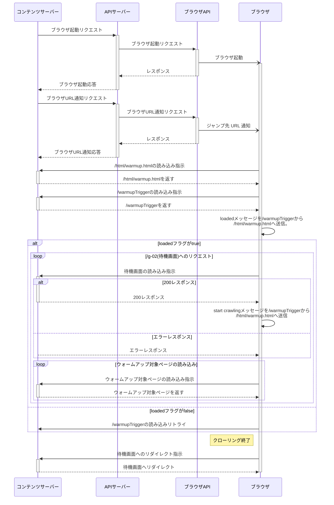

```mermaid
sequenceDiagram
    participant コンテンツサーバー
    participant APIサーバー
    participant ブラウザAPI
    participant ブラウザ

    コンテンツサーバー->>+APIサーバー: ブラウザ起動リクエスト
    APIサーバー->>+ブラウザAPI: ブラウザ起動リクエスト
    ブラウザAPI-)ブラウザ: ブラウザ起動
    activate ブラウザ
    ブラウザAPI-->>-APIサーバー: レスポンス
    APIサーバー-->>-コンテンツサーバー:ブラウザ起動応答
    コンテンツサーバー->>+APIサーバー: ブラウザURL通知リクエスト
    APIサーバー->>+ブラウザAPI:ブラウザURL通知リクエスト
    ブラウザAPI-)ブラウザ:ジャンプ先 URL 通知
    ブラウザAPI-->>-APIサーバー: レスポンス
    APIサーバー-->>-コンテンツサーバー:ブラウザURL通知応答
    ブラウザ->>+コンテンツサーバー:/html/warmup.htmlの読み込み指示
    コンテンツサーバー-->>-ブラウザ: /html/warmup.htmlを返す
    ブラウザ->>+コンテンツサーバー:/warmupTriggerの読み込み指示
    コンテンツサーバー-->>-ブラウザ: /warmupTriggerを返す
    ブラウザ->>ブラウザ: loadedメッセージを/warmupTriggerから<br>/html/warmup.htmlへ送信。
      alt loadedフラグがtrue
        loop /g-02(待機画面)へのリクエスト
            ブラウザ->>+コンテンツサーバー: 待機画面の読み込み指示
            alt 200レスポンス
                コンテンツサーバー-->>-ブラウザ: 200レスポンス
                ブラウザ->>ブラウザ: start crawlingメッセージを/warmupTriggerから<br>/html/warmup.htmlへ送信
            else エラーレスポンス
                コンテンツサーバー-->>ブラウザ: エラーレスポンス
            end
            loop ウォームアップ対象ページの読み込み
                ブラウザ->>+コンテンツサーバー:ウォームアップ対象ページの読み込み指示
                コンテンツサーバー-->>-ブラウザ: ウォームアップ対象ページを返す
            end
        end
    else loadedフラグがfalse
        ブラウザ->>コンテンツサーバー:/warmupTriggerの読み込みリトライ
    end
    Note left of ブラウザ: クローリング終了
    ブラウザ->>+コンテンツサーバー: 待機画面へのリダイレクト指示
    コンテンツサーバー-->>-ブラウザ: 待機画面へリダイレクト
    deactivate ブラウザ
```
