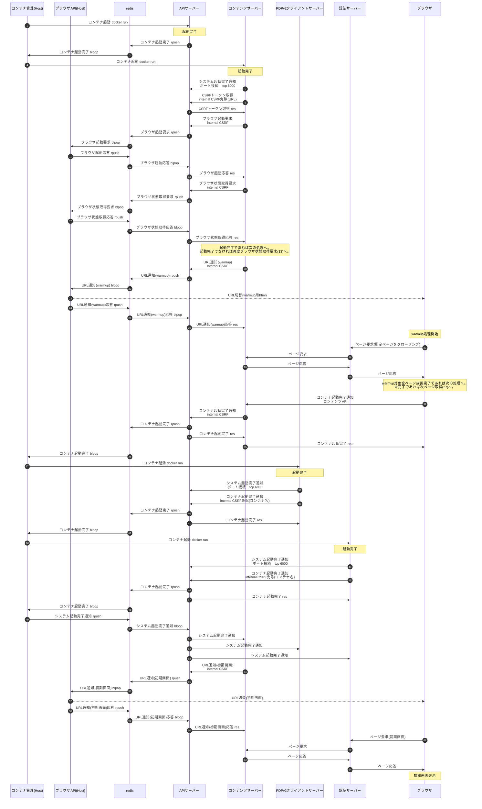
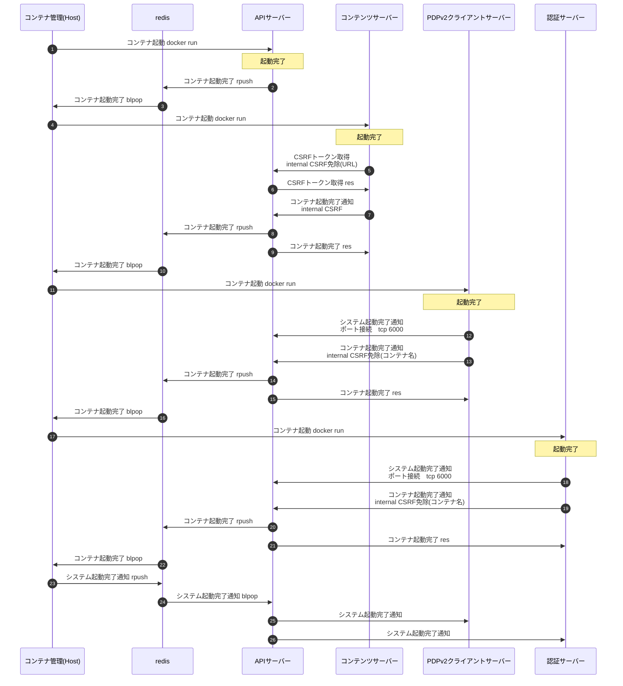
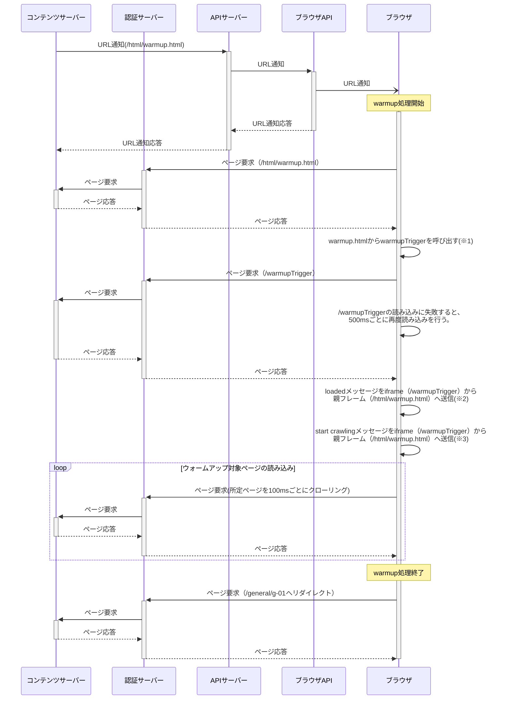

## 6. Webアプリ起動処理
### 6.1. Webアプリコンテナ起動
* AiSEG3起動時、ホストのコンテナ管理が各コンテナの起動を順次実施する。
* 各コンテナはコンテナ起動完了時にホストのコンテナ管理に起動完了通知を行う。
  各コンテナはAPIサーバーのAPI経由、APIサーバー自身は直接通知する。
* 所定のコンテナが全て起動完了した場合、ホストのコンテナ管理からシステム起動完了が通知される。
* システム起動完了通知はredis経由となるため、APIサーバーにてシステム起動完了を受け取り、各コンテナにAPIサーバーから通知を行う(コンテナの中でredisに接続しているのはAPIサーバーだけのSW構成となっているため)。そのため、各コンテナは自身の起動完了通知を行う前に、APIサーバーにシステム起動完了通知を受け取るためのtcpソケットのコネクションを確立しておく必要がある(システム起動完了通知が不要な場合は不要)。
* 各コンテナへのシステム起動完了通知についてtcpソケットを採用した理由は以下。
  - PDPv2クラアイアントとAPIサーバー間はWebSocketを使用して通信しているが、WebSocketを必要としないコンテナもある。各コンテナ毎に異なるプロトコルで通知を上げるとAPIサーバーの処理が煩雑化するため、汎用的なtcpソケットに統一する。
  - また、システム起動完了後にWebSocketを開通するという起動シーケンスの要件にも対応可能となる。
  - tcpソケットのコネクション確立を各コンテナの起動完了のひとつの条件にできる。(udpソケットはコネクションという概念がなく、送信してみないと経路が確立しているか分からないので不採用)。

#### 6.1.1. Webアプリコンテナ起動シーケンス(本体モニタ有りモデル)
* APIサーバー、認証サーバーについては、各ポートのオープン処理後に起動完了扱いとしている。
* 認証サーバー起動後は、コンテンツアクセス(8443)ポート、WebAPI(443)ポートにアクセス可能となるが、認証サーバーにシステム起動完了が通知されるまで、外部からのリクエストについては受付不可（エラーレスポンス503が返る）。localhostからのリクエストについては受付可。
* コンテンツサーバーについては、Next.js自体の仕組みでサーバー起動に関係するアプリケーションロジックを実装できる機構がないため、同サーバー内にNext.jsの起動を監視する別プロセスを起動し、Next.jsのコンテンツにアクセスできたら起動完了扱いとしている。

#### 6.1.2. Webアプリコンテナ起動シーケンス(本体モニタ無しモデル)
* 本体モニタ有りモデルのシーケンスから本体内ブラウザ制御に関する部分を削除したシーケンスとなる。それ以外は、本体モニタ有りモデルのシーケンスと同様。
  

### 6.2. ウォームアップ機能(初回アクセス高速化)
コンテンツサーバ起動直後は、ブラウザ側のキャッシュ(画像、css等)がないため、初回アクセス時の応答が2回目以降に比べると遅い。
この問題を回避するため、ユーザが最初にアクセスする前に、コンテンツサーバでウォームアップ処理を行う。
本体起動後の画面表示前にあらかじめキャッシュを溜めておき、ユーザからの初回アクセスに対する応答速度を向上させる。
具体的には以下の処理を行う。

#### 6.2.1. モニタ付きAiSEG3ブラウザ起動時
* ブラウザ起動後、ナビゲーションから遷移できる各画面に順次アクセスする。（クローリング）
  * １つのページのロードが終わると、100ms後に次のページをロードする。
  * クローリングが完了後は待機画面（/general/g-01）に遷移する。
* クローリング対象ページは以下
  | カテゴリ     | URL                |
  | ------------ | ------------------ |
  | お気に入り   | /bookmark/b-01     |
  | コントロール | /control/c-01      |
  | エネルギー   | /energy/e-01       |
  | お知らせ     | /notification/n-01 |

* **※1：**/html/warmup.htmlと/warmupTriggerは親フレームと子フレーム（iframe）の関係。
  /html/warmup.htmlが読み込まれると、最初に/warmupTriggerがiframeで読み込まれる。
* **※2：**/warmupTriggerの読み込みに成功したかを表すloadedフラグが/html/warmup.htmlに存在する。
  デフォルトではfalseになっており/warmupTriggerが読み込まれると、/html/warmup.htmlにloadedというメッセージが送信され、/html/warmup.htmがこれを受け取るとloadedフラグがtrueになり/warmupTriggerの読み込みが成功したことになる。
  この判定によりブラウザが確実に起動していることを担保する。
* **※3：** loadedフラグがtrueになると、次に/warmupTriggerは待機画面（/general/g-01）へリクエストを送り、待機画面の起動確認を行う。
  レスポンスが200の場合、/warmupTriggerはstart crawlingメッセージを/html/warmup.htmlへ送る。
  /html/warmup.htmlはそれを起点にクローリングを開始する。
  レスポンスがエラーの場合、/warmupTriggerは再度待機画面へリクエストを送る。

