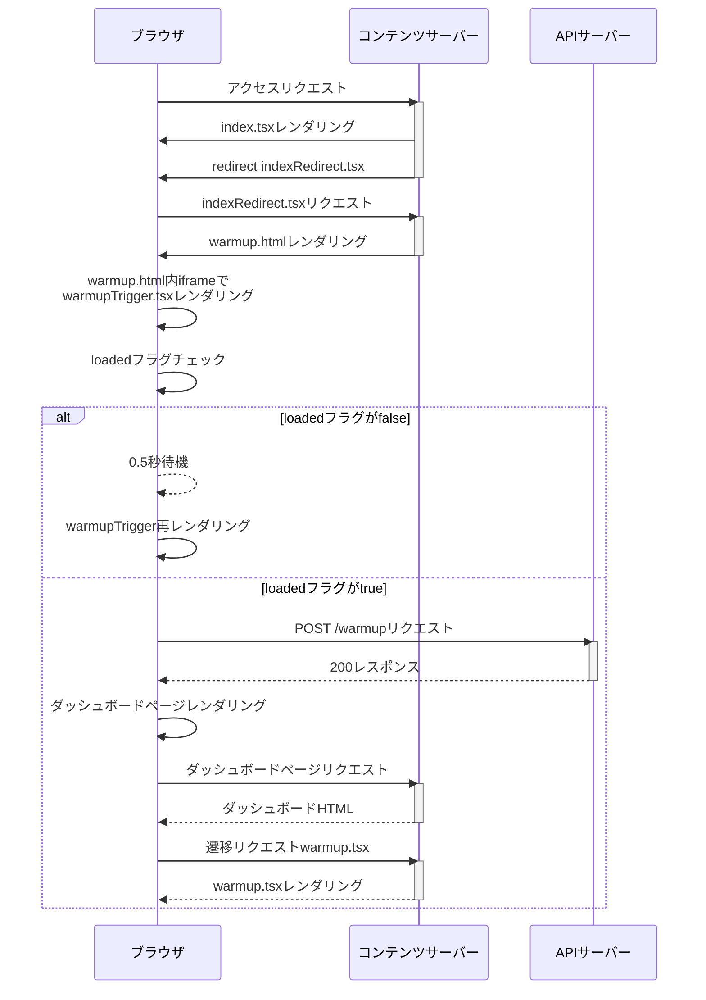

```mermaid
sequenceDiagram
    participant B as ブラウザ
    participant S as コンテンツサーバー
    participant A as APIサーバー
    B->>S: アクセスリクエスト
    activate S
    S->>B: index.tsxレンダリング
    S->>B: redirect indexRedirect.tsx
    deactivate S
    
    B->>S: indexRedirect.tsxリクエスト
    activate S
    S->>B: warmup.htmlレンダリング
    deactivate S
    
    B->>B: warmup.html内iframeで<br/>warmupTrigger.tsxレンダリング
    B->>B: loadedフラグチェック
    alt loadedフラグがfalse
      B-->>B: 0.5秒待機  
      B->>B: warmupTrigger再レンダリング 
    else loadedフラグがtrue
      B->>A: POST /warmupリクエスト
      activate A
      A-->>B: 200レスポンス 
      deactivate A

      B->>B: ダッシュボードページレンダリング
      B->>S: ダッシュボードページリクエスト 
      activate S
      S-->>B: ダッシュボードHTML
      deactivate S

      B->>S: 遷移リクエストwarmup.tsx 
      activate S
      S-->>B: warmup.tsxレンダリング
      deactivate S
    end
```